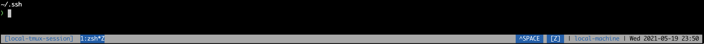

# My dotfiles and configs

![license](https://img.shields.io/static/v1?label=License&message=MIT&color=blue&logo=data:image/png;base64,iVBORw0KGgoAAAANSUhEUgAAACgAAAAmCAYAAAC29NkdAAAAAXNSR0IArs4c6QAAAJZlWElmTU0AKgAAAAgABQESAAMAAAABAAEAAAEaAAUAAAABAAAASgEbAAUAAAABAAAAUgExAAIAAAARAAAAWodpAAQAAAABAAAAbAAAAAAAAABXAAAAAQAAAFcAAAABd3d3Lmlua3NjYXBlLm9yZwAAAAOgAQADAAAAAQABAACgAgAEAAAAAQAAACigAwAEAAAAAQAAACYAAAAAZOTqXQAAAAlwSFlzAAANYQAADWEBPCRiLgAAApRpVFh0WE1MOmNvbS5hZG9iZS54bXAAAAAAADx4OnhtcG1ldGEgeG1sbnM6eD0iYWRvYmU6bnM6bWV0YS8iIHg6eG1wdGs9IlhNUCBDb3JlIDYuMC4wIj4KICAgPHJkZjpSREYgeG1sbnM6cmRmPSJodHRwOi8vd3d3LnczLm9yZy8xOTk5LzAyLzIyLXJkZi1zeW50YXgtbnMjIj4KICAgICAgPHJkZjpEZXNjcmlwdGlvbiByZGY6YWJvdXQ9IiIKICAgICAgICAgICAgeG1sbnM6dGlmZj0iaHR0cDovL25zLmFkb2JlLmNvbS90aWZmLzEuMC8iCiAgICAgICAgICAgIHhtbG5zOnhtcD0iaHR0cDovL25zLmFkb2JlLmNvbS94YXAvMS4wLyIKICAgICAgICAgICAgeG1sbnM6ZGM9Imh0dHA6Ly9wdXJsLm9yZy9kYy9lbGVtZW50cy8xLjEvIj4KICAgICAgICAgPHRpZmY6T3JpZW50YXRpb24+MTwvdGlmZjpPcmllbnRhdGlvbj4KICAgICAgICAgPHhtcDpDcmVhdG9yVG9vbD53d3cuaW5rc2NhcGUub3JnPC94bXA6Q3JlYXRvclRvb2w+CiAgICAgICAgIDxkYzp0aXRsZT4KICAgICAgICAgICAgPHJkZjpBbHQ+CiAgICAgICAgICAgICAgIDxyZGY6bGkgeG1sOmxhbmc9IngtZGVmYXVsdCI+U2NhbGU8L3JkZjpsaT4KICAgICAgICAgICAgPC9yZGY6QWx0PgogICAgICAgICA8L2RjOnRpdGxlPgogICAgICA8L3JkZjpEZXNjcmlwdGlvbj4KICAgPC9yZGY6UkRGPgo8L3g6eG1wbWV0YT4K/yAYnwAABolJREFUWAm9mMuPVUUQh+fyFBUQVBAdVFDEt8hCIRIjgY2GhQbi1rgzcadrFiZq9E8wrtTEGHVhYkLERF2RKARFRCPGjIw4iLycAD6AGcbv69t1ps+ZMwPDECv53a6qruqqrn7de3t6LgONjIx0HIb2BpH5pJvq8DOmOkD2N5kRcFOWD9OGLqsurZlUglRnGmGEZEKSiUwHZ8ASEDQT+2GE0s6+kU6no/6iaMIECWBwE7I9z8DnbUGThrIiKtiDrQmPS4wdsWPcVtswqnXmxIiREqpmi34pho+CtWAZmAlczm3YvkfbC1LFsH0GfgO4HpwF/WAP2IntPhCTQoUTxYCi2knnh5WpUWkIP4fOlWAj2ATWgNmgjd5EeW/u+JH22TajrNtP+znYDnaR2CH1ZWzlMYRBqijtZrAPHABNOoMicLbgx7MrbfQbbhieRP4FbDYh2tqq1gT6o6IL4O/RoYVmtejaVBdrdzXOc4ExpcghCc0EY1+8nQ2fpN0KHKTtcKBO5DhHwGvAQM+B60C1f+GbZCIepJfBO+B9IEUOSagl6Ca1xLQuywEsPgV9yIPJ+gIf+BzFZDr231/ANHVjvwhmG+jHx+U3di3BuNPCgf7OEIZWwRfhI/CEnehmgenj4AptIJfKams/exxbx4jlfxzTD8Bt6K5qJuc4tQQL+X74gzj0087HeSb8WTDcBmxi1p7wOOVDbbZZ5wpdie0c5AHa30G6AdDXcqoJGMU9dDv8d0A6CO6TaTqra5DJRXUaXV2RMXx1pFWgL3E9Pd/S3pX52iGpEsSRyXTO096I4Tn449nha9o40TXn3G8TEysrGLrCLLGhX4m0Ww2xrOA0Yl8L7zVUxakS1EBj6EGQNjmGbtpDyO6neTprMAFZvahgJFKZGxiyCL4uJnYc3tdI8vI2thS5jDIo4xrphY/ljSA/o3NJXOZYIsWgsKuWmOCYjlYiG0ZgE/G1kSLuHvhlSTO6It0EGWhaHvAODP6EdxN7XUTFdF7RdM6yTSRo9aIiRXfFRjK3oHHfWUWX1Fh/If4NfzO8VU7LHDOKNX8gHGlT0Ow8iHwOfknpjC4RulqC2NXuV40MqB10K+JpeJOJ1Qh/V662zClBjJ2FM18I715wZjHbcP6h6awdfjE5RccQYxJEF8UwgdoWKmLto8/7N1XW1pMTjl4lAyqLmZWJ7qXL/SlF8l2Jz+zjEptcHJSqPxfBWL4e6RAWiSX/LB9lrHRrmJsOUQGV3wCploDBcfY73SD8CniaamLJgQ8TC1hFKY1d2Brjj+wfy5sM+YiY7ncfCqnj4XB55yPMhh9wMAdI3aMfIbuxV2V1TCys4oC0VTBsXSUTkCKhJOSkaTp9KOaSh6/McCyvQb1KpBisK6nI+5HW/bkAZ5++OOFhF9VzzNoSa4uPT5vv7QF4mjFFcJzIpx8+VTEUd6Jwg0ruyxkt8I6TjoBURWz0jwnZb5LKYRt7E1XPavCbDOQXjzEx0Ec+HiKrnZJZSDvAjI6poPWZ86Fvwu9u0icgfhyZTCx/eXqrBHXItJh2uzxjn2kZ33jncv8h2mNMYp4zfh2sRNhIOxdEQNgamYzLav867J3ULiuBPASigrA98fXLw+X96divgPXw2lmpieKcon8tWOMSrAUOMhl6FWd9Pc7pNNLeDXwBpHW53+S18y3/2I5J0H5suysFsxB82HB2Y4uSvKOeMqgEXya4ujC0Yvb75TT2qPLzwKuqJGPExEL/hv6J0KRZKsA/Bt4FfeA0+AeY1JdgK3C/alf6RAXXoA/aVNqhdCLpANAuBi+B3eAE+Bf4y+4n8BZ4RF8JvntXwnhyq4sT3hPmH0G9wDuyIvsqAQY5ElwPH7RFG4SmbVzgaQj6XbmlYBGIE5z8kFPl0wBs5HRpojQYYvrhcjiN0g2ks31+5fdAtFEcDPv8wT+G8HWvx1ie2hMYiUT0mY+XZBWjNkM60uWbs4+9o4MTqN383SFrnycLabDga2w5VkucKrGa01SEHMRlcZlOATf8csekrZbtUmNMeQACx7PmFvCOi8qbU/TJ/39kZYD//6VkaL3nvgBBO2B8e62iJ1jby1GM9knmIPF21gLRtwX8CiR/9AvJb0ZPlyMil+98WenSbHI8g44ZCN1y8ALYC4LK16jk/ZfsRbC8GRndmLGbNhMaOABEM3INjg8DL9EN4CEQN4Anz3Hcg/G+Kse7XdrtRP8Z2AG+YmxflRQDuZX+A4xhKLy4aqlpAAAAAElFTkSuQmCC)
[](https://github.com/agronskiy/yasli)


<a href="https://asciinema.org/a/461991" target="_blank"></a>


Some bits and pieces of the bashrc used here and there across my (Ubuntu/macos) machines, e.g. for prompt and commands.

# Features

Along with many very personal features there are several which might be useful for common use-cases.

## Nested tmux

Pressing `F12` allows to dynamically switch off the `prefix` for outer tmux when logging in to a remote ssh with another (inner) tmux.
The status bar is greyed out and the `prefix` is propagated to the inner tmux.

Local machine tmux only:



Local and remote, with local no receiving `prefix`:


# Installation

Clone this repo into `~/.dotfiles`, clone [YASLI Framework](https://github.com/agronskiy/yasli) to `.yasli`, and run `yasli-main`:
```bash
git clone https://github.com/agronskiy/configs.git $HOME/.dotfiles
git clone https://github.com/agronskiy/yasli.git $HOME/.yasli
~/.yasli/yasli-main
```

This would 99% smoothly install everything in a "Darwin" <-> "Ubuntu" cross-platform manner.

## Some things one does manually

- install nerd fonts
- check latest neovim
- check that iterm settings (on mac) are imported from the linked file


## Trivia


### Caveat: Git autocompletion with git homebrew

See [SO thread](https://stackoverflow.com/questions/24513873/git-tab-completion-not-working-in-zsh-on-mac):

- Git from brew installs its own version of git completions which a) is less powerful and b) comes first on `$fpath`:
```
ls ${^fpath}/_git(N)
```

In the homebrew case that can be the violating path:
```
> ll /usr/local/share/zsh/site-functions/_git

/usr/local/share/zsh/site-functions/_git@ -> ../../../Cellar/git/2.30.1/share/zsh/site-functions/_git
```

Need to delete that one and, assuming `oh-my-zsh` is installed, one gets the right one.

# Snippets 

## Highlight groups for lighter background 
```lua
highlights = {
  init = {
    -- `NC` are non-current. The color corresponds to my unfocused color for
    -- e.g. tmux panes etc.
    NormalNC = {
      bg = inactiveBgColor,
    },
    WinBarNC = {
      bg = inactiveBgColor,
    },
    NormalFloat = { -- overrides the floating windows
      bg = activeBgColor,
    },
    TelescopeBorder = {
      bg = activeBgColor,
    },
    TelescopeNormal = {
      bg = activeBgColor,
    },
    TelescopePromptBorder = {
      bg = activeBgColor,
    },
    TelescopePromptNormal = {
      bg = activeBgColor,
    },
    TelescopeResultsBorder = {
      bg = activeBgColor,
    },
    TelescopeResultsNormal = {
      bg = activeBgColor,
    },
    TelescopePreviewBorder = {
      bg = activeBgColor,
    },
    TelescopePreviewNormal = {
      bg = activeBgColor,
    },
  }
},
```

## `nvim-cmp` setup for darker background
```lua
cmp = function(opts)
  -- opts parameter is the default options table
  -- the function is lazy loaded so cmp is able to be required
  local cmp = require "cmp"
  -- https://www.reddit.com/r/neovim/comments/yo77q6/comment/j6rr9kc/?utm_source=share&utm_medium=web2x&context=3
  vim.api.nvim_set_hl(0, "CustomCmpBG", { bg = activeBgColor })

  local border_opts = {
    border = "single",
    winhighlight = "Normal:CustomCmpBG,FloatBorder:CustomCmpBG,CursorLine:Visual,Search:None",
  }
  opts.window.completion = cmp.config.window.bordered(border_opts)
  opts.window.documentation = cmp.config.window.bordered(border_opts)
  -- return the new table to be used
  return opts
end,
```

## Setup of `telescope` before switch to `lua-fzf`
```lua
  -- Fuzzy Finder (files, lsp, etc)
  {
    "nvim-telescope/telescope.nvim",
    dependencies = {
      "nvim-lua/plenary.nvim",
      { "nvim-telescope/telescope-fzf-native.nvim", enabled = vim.fn.executable "make" == 1, build = "make" },
      { "cbochs/grapple.nvim" },
      { "reaz1995/telescope-vim-bookmarks.nvim" },
    },
    cmd = "Telescope",
    opts = function()
      local actions = require "telescope.actions"
      local layout_actions = require("telescope.actions.layout")
      local common_settings = {
        w = 0.95,
        h = 0.9,
        vert_lines_cutoff = 20,
      }
      return {
        defaults = {
          git_worktrees = vim.g.git_worktrees,
          path_display = { "truncate" },
          sorting_strategy = "ascending",
          layout_strategy = "horizontal",
          layout_config = {
            horizontal = { prompt_position = "top", preview_width = 0.55 },
            preview_cutoff = 120,
            width = common_settings.h,
            height = common_settings.h,
            vertical = {
              mirror = true,
              prompt_position = "top",
              preview_cutoff = common_settings.vert_lines_cutoff,
              -- :h telescope.resolve
              preview_height = function(_, _, max_lines)
                -- Logic: keep preview dynamically changing in order to fix results
                -- height fixed
                if max_lines < common_settings.vert_lines_cutoff then
                  return math.ceil(max_lines * common_settings.h) - 6
                end
                return math.ceil(max_lines * common_settings.h) - 12
              end,
            }
          },
          mappings = {
            i = {
              ["jk"] = actions.close,
              ["<F2>"] = layout_actions.toggle_preview,
              ["<C-f>"] = actions.to_fuzzy_refine,
              ["jl"] = false,
              ["jj"] = false,
              ["<C-n>"] = actions.cycle_history_next,
              ["<C-p>"] = actions.cycle_history_prev,
              ["<C-j>"] = actions.move_selection_next,
              ["<C-k>"] = actions.move_selection_previous,
              ["<C-q>"] = actions.smart_send_to_qflist + actions.open_qflist,
            },
            n = { q = actions.close },
          },
        },
        pickers = {
          find_files = {
            preview = {
              hide_on_startup = true, -- long paths friendly
            }
          },
          buffers = {
            preview = {
              hide_on_startup = true, -- long paths friendly
            },
            layout_config = {
              width = 0.5,
              height = 15,
            }
          },
          oldfiles = {
            preview = {
              hide_on_startup = true, -- long paths friendly
            }
          },
          lsp_references = {
            fname_width = 80,
          },
          lsp_document_symbols = {
            fname_width = 80,
            symbol_width = 35,
          },
          lsp_workspace_symbols = {
            fname_width = 80,
            symbol_width = 35,
          },
        },
      }
    end,
    config = function(_, opts)
      -- Enable telescope fzf native, if installed
      require("telescope").setup(opts)
      pcall(require("telescope").load_extension, "fzf")     -- might be unavailable, hence pcall
      pcall(require("telescope").load_extension, "grapple") -- might be unavailable, hence pcall
    end,
  },

```

# Acknowledgements
This started as a heavily adjusted version by @holman, inspiration from @AndreiBarsan and @samoshkin.

Uses [Material Icons](https://github.com/material-icons/material-icons)
